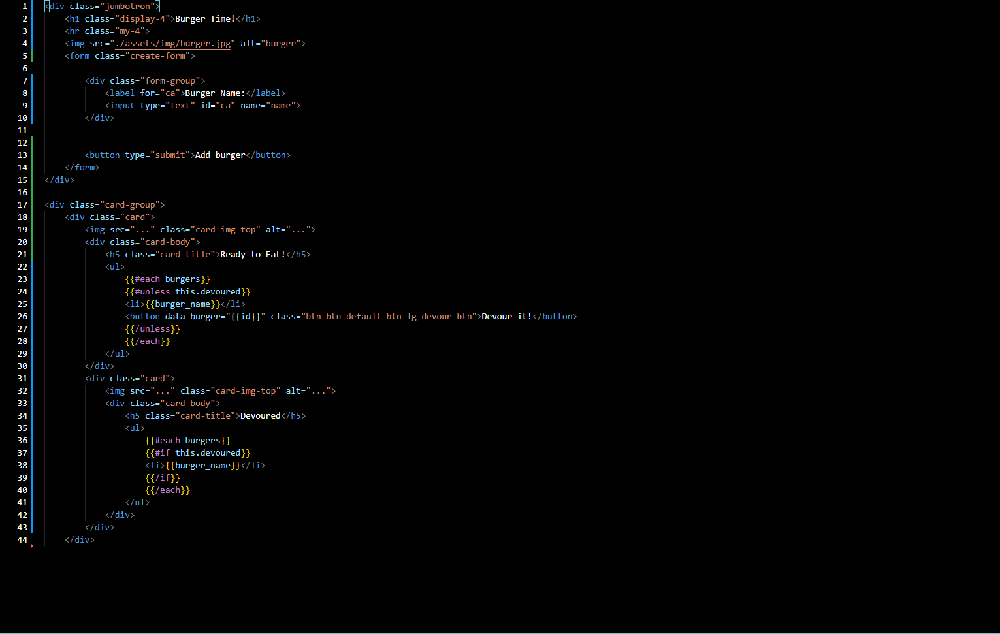
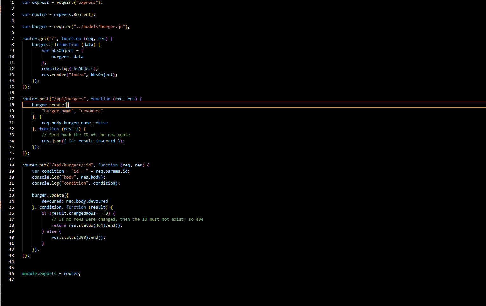

# Burger Time

## Description

This is a simple application where the user can place orders and eat the orders he placed using CRUD.

## Installation

Install your modules with npm i. Start the server and go the port address.

## Usage

It will run localy or on Heroku.

## License

This project uses the MIT_License license.

## Contributers

Javascript CSS Handlebars Heroku Express

## Images

## Questions

If you have any questions or suggestions, please contact me here:
[oscar.oses.1127@gmail.com](oscar.oses.1127@gmail.com)
